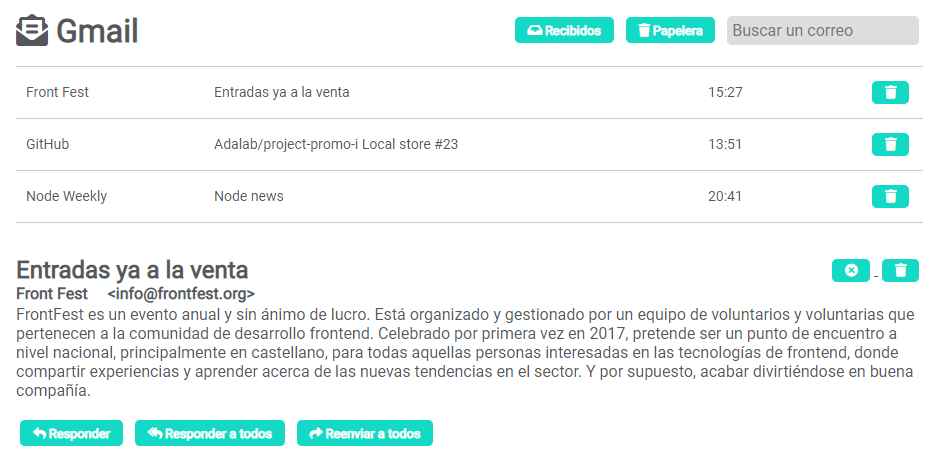

## Ejercicio extra: Gmail

- Gestor de correo, donde se debe pintar un listado de emails
- Buscar un email filtrando
- Eliminar un email de la lista
- Al eliminarlo debe guardarse en otro listado que corresponde a la papelera
- La papelera se debe pintar cuando se navegue a dicho enlace (usando router)
- Mostrar detalle del email (usando router)

